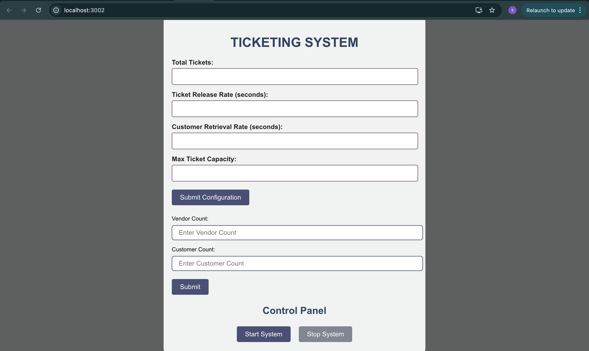

# Ticket Booking System

This project is a real-time ticketing system designed to handle simultaneous ticket releases and purchases, making it ideal for small-scale event organizers and academic purposes. It ensures efficient concurrency management by maintaining data integrity in a multi-threaded environment, allowing vendors to release tickets and customers to purchase them seamlessly. The system guarantees smooth and error-free operations during concurrent transactions. Featuring a user-friendly configuration interface, the frontend is developed using React, while the backend is powered by Spring Boot, ensuring a robust and reliable platform.


## Features

- Vendors adding tickets to the ticketpool
- Customers purchasing tickets 
- Used Concurrency
- COnfigurations saving to Json


## Deployment

To deploy this project run

```bash
  npm run start
```


## Screenshots


